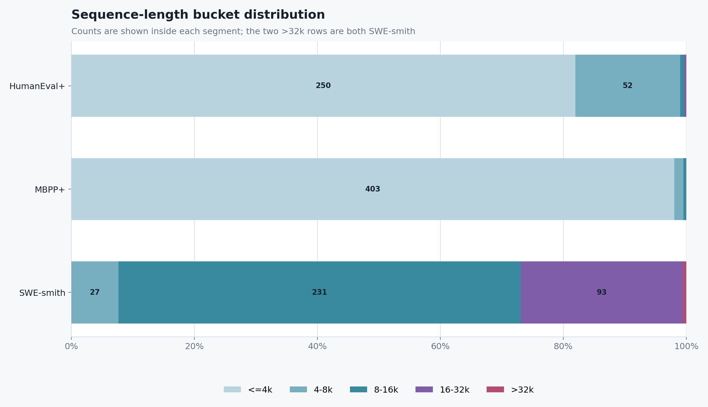
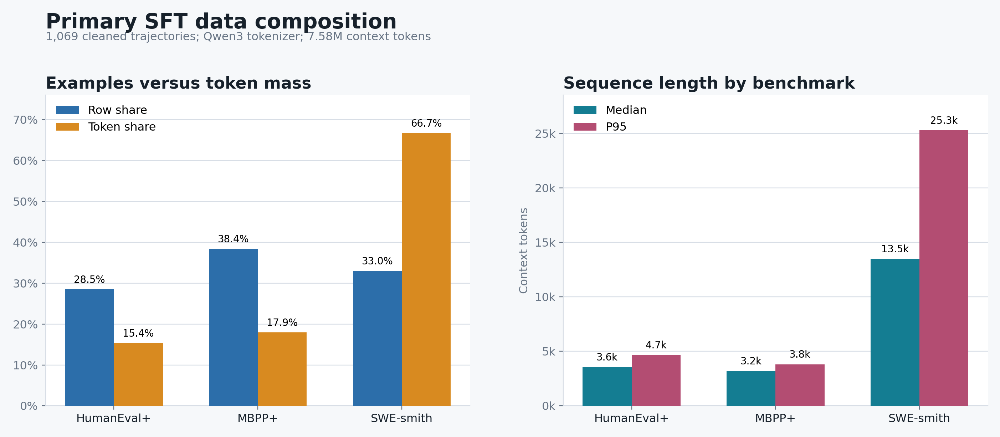
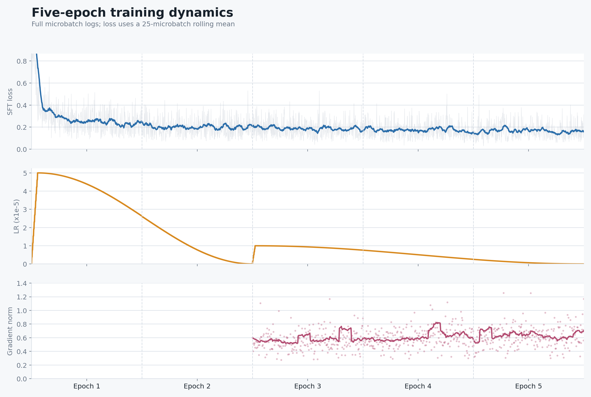
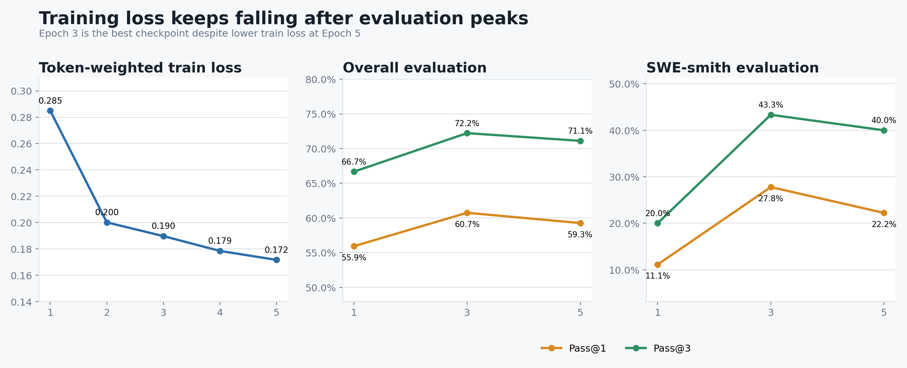
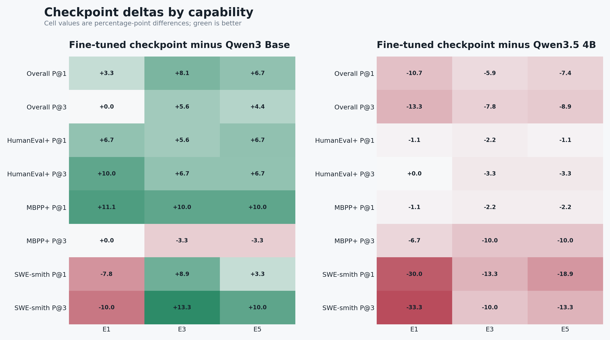
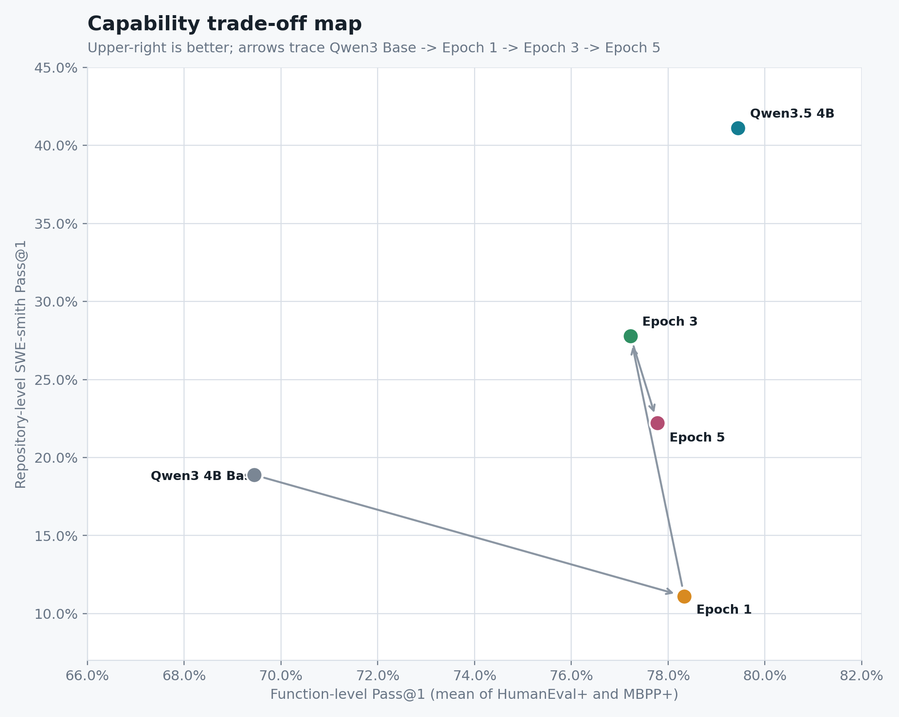
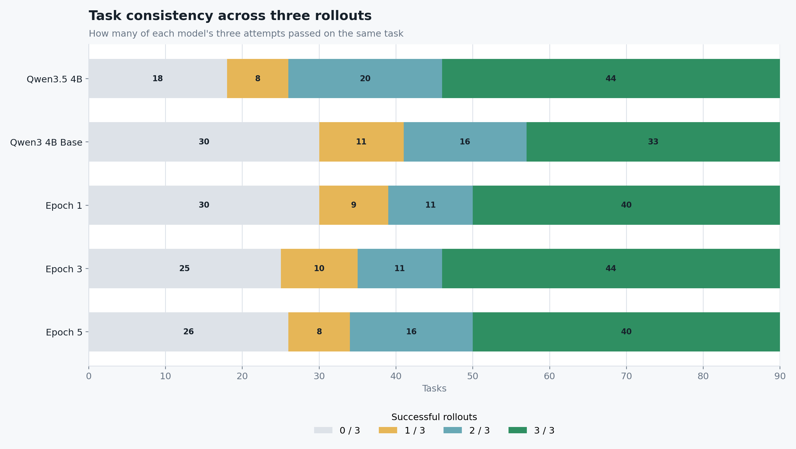
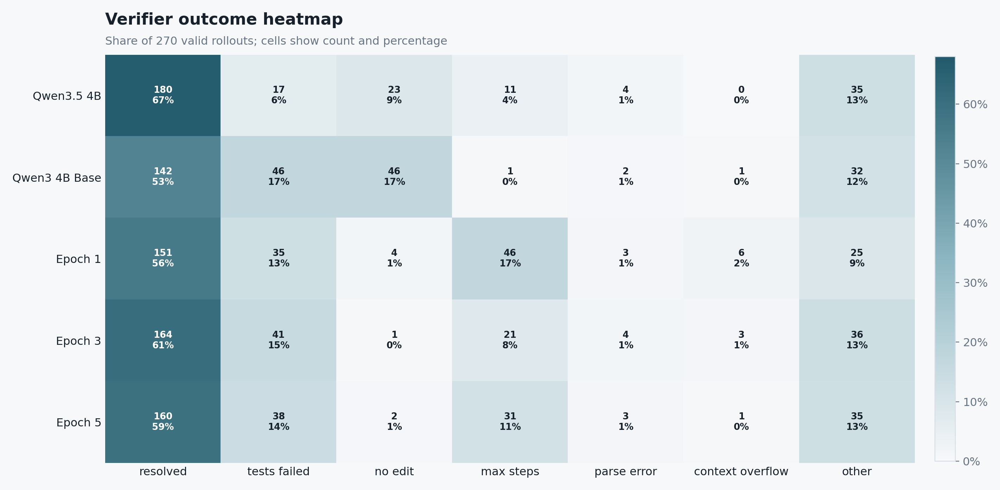
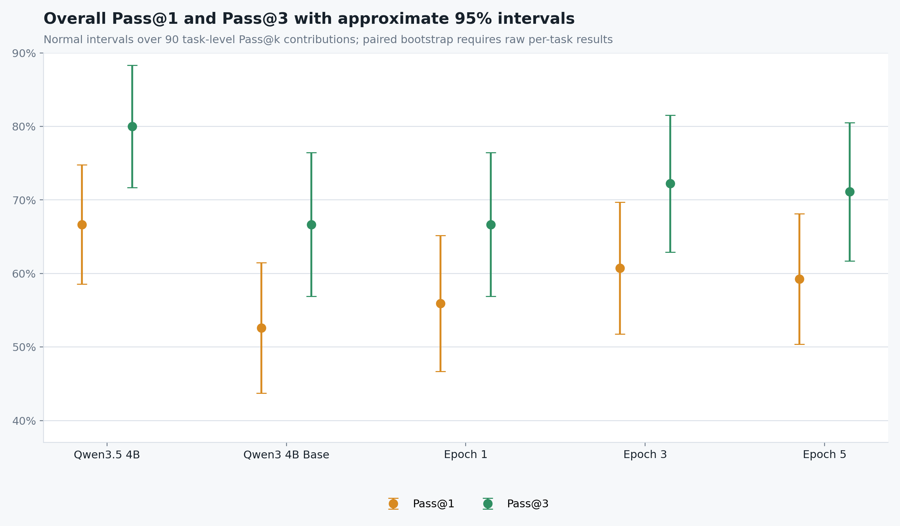

# TraceRepair Agent 完整项目技术报告

**报告日期：** 2026-08-19  
**工程实现名：** Lottie Code Agent  
**项目目录：** `code_agent_quickstart`  
**覆盖范围：** Agent Runtime 与 Harness、任务构造与防泄漏、Gold sanity、轨迹采集、Verifier、Strict/Salvage 清洗、Token/Mask、长序列分桶 LoRA SFT、统一 Pass@3 评测、SWE-smith 数据扩展与下一阶段方案

---

## 1. 执行摘要

本项目建立了一条可审计、可断点恢复、可复现的代码智能体训练闭环：

1. 从 MBPP+、HumanEval+ 和 SWE-smith 构造互斥的 train/validation/evaluation 任务集；
2. 用统一 Harness 将自然语言任务转换为结构化工具调用、真实环境反馈和独立 verifier 结果；
3. 使用 DeepSeek V4 Flash 对 300 个训练任务各采样 4 次，共采集 1200 条有效轨迹；
4. 将成功轨迹分成 Strict、Salvage A/B/C，并保留全部正负轨迹供后续 RL 使用；
5. 使用 Qwen3-4B 的精确 tokenizer 构造 assistant-only Mask V2 数据，保留完整工具上下文但只监督合法 assistant 动作；
6. 在 96 GB RTX PRO 6000 上以 LoRA `r=32` 完成 5 个 epoch 的分阶段 SFT；
7. 使用统一 Harness V3、vLLM 和 Pass@3 口径，对 Qwen3.5-4B、Qwen3-4B Base、Epoch 1/3/5 共 5 个版本完成 1350 条正式评测 rollout。

在首轮训练闭环完成后，项目又按相同准入方法构建了第二批 100 道 SWE-smith 训练任务，覆盖 20 个全新仓库，与既有 train/validation/evaluation 在仓库和 instance 两个层面均零重叠。该扩展集已完成 100/100 Gold sanity，但尚未采集 teacher 轨迹，也未进入本报告的 SFT 与评测数字。

项目的关键结果：

| 指标 | 数值 |
|---|---:|
| 正式训练任务 | 300 |
| 每题采样 | 4 |
| 原始有效轨迹 | 1200 |
| Verifier 成功轨迹 | 1090，90.83% |
| Primary SFT 源轨迹 | 1069 |
| Qwen 32K 训练窗口 | 1071 |
| 单轮 context / supervised token | 7,585,639 / 709,568 |
| LoRA | `r=32, alpha=64, dropout=0.05` |
| 当前最佳 checkpoint | Epoch 3 |
| Qwen3 Base Overall Pass@1 / Pass@3 | 52.59% / 66.67% |
| Epoch 3 Overall Pass@1 / Pass@3 | **60.74% / 72.22%** |
| Base SWE-smith Pass@1 / Pass@3 | 18.89% / 30.00% |
| Epoch 3 SWE-smith Pass@1 / Pass@3 | **27.78% / 43.33%** |
| DeepSeek V4 Flash compatibility Pass@1 / Pass@3 | 88.52% / 92.22% |
| 新增 SWE-smith 候选 | 100 题、20 个新仓库，100% Gold sanity |

最终判断是：**这轮 SFT 成功地增强了 Qwen3-4B 的工具协议、编辑意愿、函数实现和部分仓库级闭环能力；Epoch 3 是当前最平衡的 checkpoint。** Epoch 5 虽然训练 loss 更低，但整体和 SWE-smith 评测开始回落，说明下一步应扩大独立仓库级数据覆盖，而不是继续重复现有数据或优先把 LoRA rank 提到 64。

---

## 2. 项目目标与研究问题

项目希望回答四个问题：

1. 能否把普通指令模型转化为遵循结构化工具协议的代码 Agent？
2. 函数级题目和真实仓库级题目能否在一套 Harness 中统一采集和验证？
3. 仅依赖 verifier 成功轨迹进行小规模 LoRA SFT，能否显著提升 4B 模型？
4. 模型能力提升来自格式模仿、编辑行为，还是已经扩展到仓库级规划和验证闭环？

端到端系统如下：

该设计把“模型是否遵守协议”“是否真正修改代码”“测试是否通过”“运行是否因基础设施失败”拆开记录，避免把格式错误、环境错误和真实任务失败混成一个指标。

---

## 3. Harness 构造

### 3.1 Harness 的职责

Harness 不是单一 prompt，而是以下组件的组合：

- **任务适配器：** 将 MBPP+、HumanEval+、SWE-smith 统一成任务描述、工作区和 verifier 接口；
- **对话协议：** 维护 `system -> user -> assistant tool call -> tool result` 的完整消息链；
- **工具执行器：** 在真实或隔离工作区执行读取、编辑、测试和 diff；
- **上下文管理：** 计算 token、保留生成空间，并在超限时显式失败；
- **完成门：** 防止模型未测试、未查看 diff 就直接结束；
- **Verifier：** 在 Agent 结束后独立判定任务是否解决；
- **持久化层：** 保存原始响应、工具消息、patch、状态、token、重试和 verifier 结果。

主要实现入口：

- [`scripts/run_swegym_patch_rollout.py`](../scripts/run_swegym_patch_rollout.py)
- [`src/code_agent_baseline/model_transport.py`](../src/code_agent_baseline/model_transport.py)
- [`src/code_agent_baseline/harness_version.py`](../src/code_agent_baseline/harness_version.py)
- [`scripts/run_pass_at_k_experiment.py`](../scripts/run_pass_at_k_experiment.py)

### 3.2 工具协议

正式训练数据使用的核心工具集合为：

| 工具 | 作用 |
|---|---|
| `execute_bash` | 搜索、读取、运行命令和检查环境 |
| `str_replace_editor` | 精确修改、插入、创建或撤销文件内容 |
| `run_tests` | 执行任务相关测试 |
| `git_diff` | 检查最终改动 |
| `finish` | 显式提交完成状态 |

Assistant 必须输出可解析 JSON 工具调用。工具执行结果作为新的 `user` 角色消息追加到上下文中，模型在下一步可以继续看到此前所有有效信息。工具反馈不会被 loss 监督，但会作为模型决策的条件上下文。

### 3.3 完成门与隐藏验证

Agent 的自报完成与 benchmark 成功是两件事：

- `finish` 只表示 Agent 认为自己完成；
- Harness 要求最近一次编辑后至少执行有效的 `run_tests` 和 `git_diff`；
- 结束后由 verifier 在独立阶段应用 patch 并运行隐藏测试；
- Gold、隐藏测试答案和预期 patch 不进入 Agent 可见 prompt。

函数题使用 EvalPlus 扩展隐藏测试；SWE-smith 使用 `FAIL_TO_PASS` 与 `PASS_TO_PASS` 测试集合，既检查目标缺陷是否修复，也检查原有行为是否回归。

### 3.4 上下文与错误处理

Harness 在每次请求前计算上下文 token，并为下一次生成预留空间。正式 bench 模式使用 `context_overflow_policy=error`，因此不会为了继续运行而静默删除关键工具反馈。

错误被分为两类：

- **模型或任务真实失败：** `no_edit`、`max_steps`、`parse_error`、`context_overflow`、测试失败等；
- **基础设施失败：** 模型 API 不可用、runner 异常、环境阻塞、OOM/HTTP 500 等。

只有基础设施失败允许重新尝试同一槽位。模型失败和 verifier 失败被保留为真实负样本，不能通过重跑“洗成”正样本。

### 3.5 Harness 版本演进

| 版本 | 策略 | 工具结果 | 提醒频率 | 修改后重置 | 是否阻塞读取 |
|---|---|---|---|---|---|
| V1 | checkpoint 后限制只读 | 旧逻辑可能不保留完整反馈 | 强制 | 否 | 是 |
| V2 | checkpoint 后每次非修改都提醒 | 保留 | 过于频繁 | 否 | 否 |
| **V3** | `append_nonmod3_action_reset_v1` | **保留** | 连续 3 次非修改后提醒 | **是** | **否** |

V3 的行为是：前 10 个动作不提醒；之后连续 3 个非修改动作才在真实工具返回之后追加一次提醒；`str_replace`、`line_replace`、`insert`、`create`、`undo_edit` 等修改动作会重置计数。读取行为仍然正常执行，提醒只是附加上下文，不覆盖工具结果。

这一修改解决了两个问题：

1. V1 会把“预算控制”变成硬阻塞，改变任务本身；
2. V2 每次读取都提醒，容易让微调模型过度响应 Harness 文本。

对应行为由 [`benchmarks/test_swegym_patch_rollout_alignment.py`](../benchmarks/test_swegym_patch_rollout_alignment.py) 覆盖。

---

## 4. 任务集与数据隔离

### 4.1 数据源

项目混合三类任务：

| 数据集 | 粒度 | 主要能力 |
|---|---|---|
| MBPP+ | 单函数 | 规格理解、基础实现、边界处理 |
| HumanEval+ | 单函数 | 算法实现、隐藏测试泛化 |
| SWE-smith Python | 仓库级 | 定位、跨文件理解、编辑、测试、回归控制 |

构建入口为 [`scripts/build_lottie_dataset_splits.py`](../scripts/build_lottie_dataset_splits.py)，最终选择记录在 [`data/dataset_splits_v1/selection.json`](../data/dataset_splits_v1/selection.json)。

### 4.2 确定性选择

任务使用固定种子 `lottie-splits-v1` 和 SHA-256 稳定排序。相同输入数据与脚本会产生相同切分，避免依赖 Python 随机迭代顺序。

SWE-smith 的准入条件包括：

- 仅涉及一个文件；
- 改动 2-30 行；
- `FAIL_TO_PASS` 数量 1-20；
- `PASS_TO_PASS` 非空；
- 问题描述至少 80 个字符；
- 按 mutation kind 分层抽样。

MBPP 任务 20 因语义歧义被排除。

### 4.3 Train / Validation / Evaluation

| Split | MBPP+ | HumanEval+ | SWE-smith | 合计 | 用途 |
|---|---:|---:|---:|---:|---|
| Train | 120 | 80 | 100 | 300 | 轨迹采集与训练 |
| Validation | 15 | 15 | 15 | 45 | Prompt、工具、超参数调试 |
| Evaluation | 30 | 30 | 30 | 90 | 最终冻结评测 |

函数题以任务 ID 隔离；SWE-smith 进一步按仓库隔离：

- Train：`funcy`、`typeguard`、`stackprinter`、`tenacity`、`python-json-logger`
- Validation：`iniconfig`、`thefuzz`、`dataset`
- Evaluation：`exceptiongroup`、`bottle`、`oauthlib`、`soupsieve`、`sqlglot`、`trio`

仓库级隔离比只隔离 instance ID 更严格，能减少模型记住同一仓库结构、测试习惯或局部代码模板带来的泄漏。

### 4.4 Gold sanity

Gold 只用于任务准入和 verifier：

- MBPP+：参考代码和 EvalPlus 隐藏测试；
- HumanEval+：`canonical_solution` 和 EvalPlus 隐藏测试；
- SWE-smith：逆转隐藏 bug-injection patch，并检查 `FAIL_TO_PASS` 与 `PASS_TO_PASS`。

项目最终记录的 300 train、45 validation、90 evaluation 共 435 道正式任务均通过本地 gold sanity，未通过环境安装、缺陷复现或 gold 修复的任务不进入分母。早期 `eval90/README` 中“仅完成部分预检”的文字反映的是构建中间状态，不是最终正式运行状态。

### 4.5 第二批 SWE-smith 训练扩展

首轮实验显示仓库级能力仍是 Qwen3-4B 与 teacher、Qwen3.5-4B 的主要差距。为避免继续重复原有 100 道 SWE-smith，项目从固定版本 `SWE-bench/SWE-smith-py@77cab9055d42ab4a5c25c89a8f937096db13558e` 的 50,908 条候选中构建了独立扩展集。

扩展集复用了首轮的数据准入原则：

- 排除既有 train、validation、evaluation 使用过的全部仓库和 instance；
- 仅保留单文件 patch、2-30 行改动、1-20 个 `FAIL_TO_PASS`、非空 `PASS_TO_PASS`；
- 问题描述不少于 80 个字符；
- 先按 mutation kind 分层，再使用 SHA-256 稳定排序；
- 选择 20 个新仓库，每个仓库 5 题；
- 只有仓库环境可安装且通过 base/bug/gold 三阶段 sanity 的任务才进入 runnable 集。

最终审计结果：

| 指标 | 结果 |
|---|---:|
| 新任务 | 100 |
| 新仓库 | 20 |
| 每仓库任务 | 5 |
| 环境 setup ready | 20/20 |
| Gold sanity | 100/100 |
| 与旧切分仓库重叠 | 0 |
| 与旧切分 instance 重叠 | 0 |
| Patch 改动行数 | 中位数 8，P90 23，最大 30 |
| `FAIL_TO_PASS` 数 | 中位数 3，P90 10，最大 19 |
| `PASS_TO_PASS` 数 | 中位数 77，P90 269，最大 2102 |

该数据位于 `data/swesmith_train_extension_v1`，当前状态是“任务构建与 Gold 校验完成”。它尚未经过 DeepSeek/GLM 等 teacher 的 rollout、轨迹清洗、Qwen tokenizer 或 SFT，因此不能计入首轮 1200 条轨迹、1069 条 SFT 源轨迹和现有模型增益。后续应把它作为新的仓库级数据来源，而不是修改或覆盖原始 300 题实验。

---

## 5. 训练轨迹采集

### 5.1 正式采集口径

正式运行目录：

`outputs/training_runs/deepseek_v4_flash_train300_rollout4_v1`

| 参数 | 正式值 |
|---|---|
| Teacher | `deepseek-v4-flash` |
| Split | train |
| 任务数 | 300 |
| 每题 rollout | 4 |
| 目标槽位 | 1200 |
| Temperature / top-p | 1.0 / 0.95 |
| 协议修复重试 temperature | 0 |
| 单步最大生成 | 4000 token |
| Thinking / reasoning | enabled / max |
| Function max steps | 12 |
| Repo max steps | 40 |
| Context | 64K，超限显式失败 |
| 模型超时 | 180 秒 |
| Function / repo verifier 超时 | 30 / 600 秒 |
| 每槽位基础设施尝试上限 | 3 |

早期 `selection.json` 曾记录过每题 5 次、共 1500 条的规划；正式运行的 `manifest.json`、目录名、结果文件和最终覆盖均明确为每题 4 次、共 1200 条，正式 manifest 是本报告采用的实验口径。

### 5.2 并发与断点恢复

采集期间为了控制 API、CPU、verifier 和本地 I/O 压力，workers 曾调整：

| 已完成槽位 | workers | 原因 |
|---:|---:|---|
| 0 | 4 | 初始策略 |
| 294 | 6 | 提高吞吐 |
| 953 | 4 | 降低资源压力 |
| 1190 | 2 | 尾部任务与本机负载控制 |
| 1192 | 1 | 最后 8 个槽位单并发补齐 |

并发变化仅属于执行策略，不改变模型、任务、采样、prompt、verifier 或步数。每次变化都写入 `execution_policy_history.jsonl`。

断点恢复遵循以下规则：

- 只有 `sample_valid=true` 的槽位被视为完成并跳过；
- 已有有效结果不删除、不覆盖；
- 基础设施尝试耗尽时，原 attempt 完整归档后再安全恢复；
- 模型失败与 verifier 失败仍然是有效 sample，不重新生成正例。

项目位于 macOS iCloud Documents 时曾出现 `fileproviderd` 写放大和机器发热。后续通过降低并发、清理孤儿 collector、打包结果后上传远程训练缓解。这是运行环境问题，不改变采集数据语义，但说明大规模轨迹不宜直接长期写在云同步目录。

### 5.3 采集结果

| 指标 | 数量 |
|---|---:|
| 有效槽位 | 1200 / 1200 |
| 完整任务 | 300 / 300，每题 4 条 |
| Verifier resolved | 1090 |
| Verifier unresolved | 110 |
| 采集 pass@1 | 90.83% |
| 采集 pass@3 | 93.67% |
| 采集 pass@4 | 94.00% |

按数据集的 rollout 数为 HumanEval+ 320、MBPP+ 480、SWE-smith 400。

主要 Agent 状态：

| 状态 | 数量 |
|---|---:|
| `resolved` | 826 |
| `edited` | 320 |
| `max_steps` | 51 |
| `no_edit` | 2 |
| `parse_error` | 1 |

主要 verifier 状态包括：1090 resolved、80 tests failed、22 一般 unresolved、3 unresolved no-edit、1 patch apply failed、1 timeout、2 model failure no-edit、1 parse error。

### 5.4 单条轨迹保存内容

每个 sample 槽位保存：

- 任务 ID、数据集、sample index 和配置哈希；
- 原始模型响应与标准化 assistant 消息；
- 每一步工具调用和真实工具返回；
- 工作区修改、patch 与 diff；
- Agent status、步数、token 和耗时；
- 独立 verifier 输出；
- 基础设施 attempt 与错误日志。

根目录还保存 `sample_results.jsonl`、`pass_at_k_summary.json`、`manifest.json` 和执行策略历史，使任务级结果和原始轨迹可以相互追溯。

---

## 6. 轨迹清洗与数据分层

### 6.1 为什么不能简单删除错误文本

多轮 Agent 轨迹中的 assistant 调用与紧随其后的工具返回是一一对应的。直接删除某段非法 JSON，可能让后续工具反馈失去来源，或把环境副作用错误归因给另一条调用。因此清洗必须在消息对和副作用层面操作，并保留原始备份。

### 6.2 清洗结果

交付包：`outputs/training_packages/lottie_train1200_cleaned_complete_v1`

| 分区 | 数量 | 默认用途 |
|---|---:|---|
| Strict | 996 | SFT 主集 |
| Salvage Tier A | 73 | SFT 主集 |
| Salvage Tier B | 13 | 可选低权重 SFT |
| Salvage Tier C | 4 | 隔离，不默认训练 |
| Manual review | 4 | 人工审核 |
| Primary SFT | 1069 | Strict + Tier A |
| RL rollouts | 1200 | 全量二元 verifier reward |

Strict 集累计验证 11,147 个 assistant JSON 工具调用，996 条均有终止 `finish`，精确重复轨迹为 0。

### 6.3 Salvage 规则

94 条候选轨迹中，90 条可恢复，4 条进入人工审查。自动恢复只允许：

1. 定位不可解析或 schema 非法的 assistant 调用；
2. 确认其没有造成环境副作用；
3. 同时删除该 assistant 消息和紧随其后的 parser/protocol rejection；
4. 保留后续合法恢复动作、工具结果、编辑、测试和 verifier 元数据；
5. 不猜测原模型“本来想调用什么”，不重写工具参数。

恢复中移除了 129 对非法 parser 消息、2 对过早 finish、6 对 protocol rejection，并为 11 条缺少规范结尾但已经完成任务的轨迹追加标准 finish。错误类型包括非 JSON 文本、非法转义、控制字符、缺少分隔符、截断字符串等。

90 条恢复轨迹全部通过独立审计，0 条失败。备份包含 662 个文件、约 43.64 MB，并通过哈希校验。

### 6.4 SFT 与 RL 的关系

本轮实际训练是严格的监督微调，不是在线 RL：

- SFT 使用 verifier 成功且协议可学习的 1069 条 primary 轨迹；
- 模型学习的是 teacher 在完整环境反馈下产生的合法动作序列；
- 110 条真实失败轨迹不进入正向 SFT，避免直接模仿失败策略；
- 全部 1200 条轨迹仍保存在 `rl_rollouts.jsonl`，带二元 verifier reward，可供后续 DPO、PPO/GRPO 或 outcome-conditioned 方法使用。

---

## 7. Tokenization 与 Mask V2

### 7.1 为什么必须先 tokenize 再 mask

Loss mask 最终作用于 token，而不是原始字符串。只有使用目标模型的精确 tokenizer 和 chat template，才能确定 assistant 内容、role header、结束标记和工具反馈分别对应哪些 token。

构建脚本：[`tools/prepare_qwen_sft_dataset.py`](../tools/prepare_qwen_sft_dataset.py)  
审计脚本：[`tools/audit_qwen_sft_arrow.py`](../tools/audit_qwen_sft_arrow.py)

### 7.2 Assistant-only 监督

Mask V2 的规则：

- system、user、工具反馈全部保留在 `input_ids` 中；
- 上述上下文的 label 统一设为 `-100`；
- 只监督合法 assistant JSON 正文、assistant 结束标记和换行；
- assistant role header 不计算 loss；
- schema 非法的 assistant turn 整体 mask；
- 对应错误反馈和之后的恢复过程仍作为上下文保留。

因此模型可以看到工具执行后的新信息，但不会被训练去“模仿工具输出”。

### 7.3 长轨迹切窗

最大训练长度为 32K。轨迹按完整的“assistant 动作 + 随后的工具反馈”单元切窗，而不是按任意 token 截断：

- 不跨不同轨迹拼接；
- 相邻窗口默认重叠 2 个完整单元；
- 重叠区域中的历史 assistant 只作为上下文，不重复计算 loss；
- 每个可训练 assistant turn 在全部窗口中只被监督一次；
- 每个窗口必须包含至少一个监督 token，并通过长度和 role 泄漏审计。

训练记录为 1069 条源轨迹切成 1071 个窗口。交付包中的预切窗长度报告包含 2 条超过 32K 的源轨迹，这与增加 2 个训练窗口一致；为了完全复现，仍建议把远端最终 Arrow manifest 和这两条轨迹的窗口映射长期归档在本地。

### 7.4 数据规模与长度分布

训练侧正式记录：

- 1071 个窗口；
- 7,585,639 context token；
- 709,568 supervised token；
- 12,604 个合法 assistant turn；
- 24 个 schema 非法调用和 4 个重叠历史调用被 mask；
- assistant 监督 token 占 context 的约 9.35%。

Primary 源轨迹长度分布：

| 长度 | 条数 | 占比 |
|---|---:|---:|
| `<=4K` | 653 | 61.09% |
| `4K-8K` | 85 | 7.95% |
| `8K-16K` | 235 | 21.98% |
| `16K-32K` | 94 | 8.79% |
| `>32K` | 2 | 0.19% |

按源轨迹统计，SWE-smith 只占 33.02% 的行数，却占 66.69% 的 context token，说明仓库级轨迹是主要计算成本。

---

## 8. LoRA SFT

### 8.1 模型与硬件

| 项目 | 配置 |
|---|---|
| 基础模型 | Qwen3-4B-Instruct-2507 |
| GPU | RTX PRO 6000 96 GB |
| 精度 | BF16 |
| Attention | SDPA |
| Gradient checkpointing | 开启 |
| LoRA rank / alpha / dropout | 32 / 64 / 0.05 |
| LoRA 目标 | q/k/v/o + gate/up/down projection |
| Optimizer | AdamW |
| Weight decay | 0 |
| Max grad norm | 1.0 |
| Gradient accumulation | 2 |
| Seed | 42 |

训练入口：[`scripts/train_qwen_lottie_lora.py`](../scripts/train_qwen_lottie_lora.py)

### 8.2 动态 microbatch

由于长度跨度从约 4K 到 32K，训练按长度桶调整 microbatch：

| 最大长度 | Microbatch size |
|---|---:|
| 4K | 8 |
| 8K | 2 |
| 16K | 1 |
| 24K | 1 |
| 32K | 1 |

不同长度桶可以有不同 microbatch，但通过 gradient accumulation 统一形成 optimizer update。不同轨迹不会在序列内部拼接，因此不存在跨任务上下文污染。

### 8.3 分阶段训练

**Epoch 1-2：**

- 学习率 `5e-5`；
- cosine scheduler；
- 3% warmup，共 13 updates；
- 每轮 457 microbatches、229 updates；
- Epoch 1 和 Epoch 2 adapter 均保存；
- optimizer/scheduler 只保留在同一训练进程内，Epoch 1 adapter 目录不含可独立续训的优化器状态。

**Epoch 3：**

- 从 Epoch 2 adapter-only 接续；
- 新阶段学习率 `1e-5`；
- warmup 6 updates；
- 以 Epoch 3-5 共 687 updates 为 scheduler horizon；
- Epoch 3 开始保存 adapter、optimizer、scheduler、RNG 和 trainer state。

**Epoch 4-5：**

- 从 Epoch 3 的完整训练状态恢复；
- 保持 `1e-5` 阶段 scheduler 连续衰减；
- 每轮保存完整状态，支持继续训练或精确复现。

### 8.4 训练统计

| Epoch | Token 加权 loss | Median loss | LR max | LR end | Grad norm median | Grad norm P95 |
|---:|---:|---:|---:|---:|---:|---:|
| 1 | 0.2849 | 0.2611 | 5.00e-5 | 2.61e-5 | 未记录 | 未记录 |
| 2 | 0.2002 | 0.1906 | 2.61e-5 | 0 | 未记录 | 未记录 |
| 3 | 0.1898 | 0.1760 | 1.00e-5 | 7.58e-6 | 0.538 | 0.804 |
| 4 | 0.1785 | 0.1635 | 7.58e-6 | 2.54e-6 | 0.596 | 0.850 |
| 5 | 0.1717 | 0.1526 | 2.54e-6 | 0 | 0.610 | 0.892 |

五轮共处理约 37,928,195 context token 和 3,547,840 supervised token。训练吞吐约 3.08K token/s，峰值 allocated 约 79.18 GiB、reserved 约 94.15 GiB。

### 8.5 Loss 与泛化

Epoch 5 的 loss 比 Epoch 3 低 0.018，但 Overall Pass@1 下降 1.48 个百分点，SWE-smith Pass@1 下降 5.56 个百分点。这是当前最重要的 early-stop 信号：训练集拟合继续改善，但冻结评测不再同步改善。

---

## 9. 正式评测设计

### 9.1 评测对象

统一评测五个模型：

1. Qwen3.5-4B；
2. Qwen3-4B Base；
3. Qwen3-4B + Epoch 1 adapter；
4. Qwen3-4B + Epoch 3 adapter；
5. Qwen3-4B + Epoch 5 adapter。

每个模型评测 90 题，每题 3 rollout：

- HumanEval+ 30 × 3 = 90；
- MBPP+ 30 × 3 = 90；
- SWE-smith 30 × 3 = 90；
- 每模型 270 条，总计 1350 条有效正式 rollout。

### 9.2 固定 Harness V3 口径

| 参数 | 数值 |
|---|---|
| Harness | `lottie_code_agent_harness_v3` |
| Policy | `append_nonmod3_action_reset_v1` |
| Temperature / top-p | 0.5 / 0.95 |
| Protocol retry temperature | 0 |
| Thinking | disabled |
| 单步最大生成 | 1024 token |
| Function / repo max steps | 20 / 60 |
| Context | 64K |
| Model timeout | 180 秒 |
| Function / repo verify timeout | 30 / 600 秒 |
| Infra attempts | 3 |

模型间只切换基础模型或 LoRA checkpoint，其余任务、采样、Harness、verifier 和步数完全一致。

### 9.3 vLLM 服务

正式本地推理使用：

- `max_num_seqs=16`；
- `max_num_batched_tokens=32768`；
- `gpu_memory_utilization=0.85`；
- `max_model_len=64000`；
- BF16；
- LoRA 最大 rank 32；
- `VLLM_USE_FLASHINFER_SAMPLER=0`，规避 Blackwell `sm120` 与 FlashInfer 检测不兼容。

Harness workers 为 16。vLLM 使用 continuous batching：请求先进入队列，scheduler 按可用 KV cache block、每轮 token 预算和 `max_num_seqs` 选择 running/waiting 请求。它不会为每个请求临时重新估算整张卡，而是在服务启动时预留模型权重和 KV cache，再按 token block 调度；个别长请求可以等待或被抢占，而不是要求 16 个请求同时达到各自 64K 上限。

每个 checkpoint 启动前检查 `/health`、`/v1/models`、模型/adapter 名称和 JSON tool-call smoke。若发生明确 OOM 或 HTTP 500，workers 按 16 -> 12 -> 8 -> 4 回退，并在相同输出目录断点续跑。

### 9.4 Pass@k

项目使用标准无偏估计：

`pass@k = 1 - C(n-c, k) / C(n, k)`

其中 `n=3` 为每题有效采样数，`c` 为其中成功数。只对完成 3 条有效 sample 的任务求平均。实现位于 [`src/code_agent_baseline/pass_at_k.py`](../src/code_agent_baseline/pass_at_k.py)。

---

## 10. 正式评测结果

### 10.1 Overall Pass@1/2/3

| 模型 | Pass@1 | Pass@2 | Pass@3 | Resolved rollout |
|---|---:|---:|---:|---:|
| Qwen3.5-4B | 66.67% | 77.04% | 80.00% | 180/270 |
| Qwen3-4B Base | 52.59% | 62.59% | 66.67% | 142/270 |
| Epoch 1 | 55.93% | 63.33% | 66.67% | 151/270 |
| **Epoch 3** | **60.74%** | **68.52%** | **72.22%** | **164/270** |
| Epoch 5 | 59.26% | 68.15% | 71.11% | 160/270 |

Epoch 3 相比 Base：Overall Pass@1 `+8.15 pp`，Pass@3 `+5.56 pp`。

### 10.2 分数据集

| 模型 | HumanEval+ P@1/P@3 | MBPP+ P@1/P@3 | SWE-smith P@1/P@3 |
|---|---:|---:|---:|
| Qwen3.5-4B | 78.89% / 93.33% | 80.00% / 93.33% | 41.11% / 53.33% |
| Qwen3-4B Base | 71.11% / 83.33% | 67.78% / 86.67% | 18.89% / 30.00% |
| Epoch 1 | 77.78% / 93.33% | 78.89% / 86.67% | 11.11% / 20.00% |
| **Epoch 3** | **76.67% / 90.00%** | **77.78% / 83.33%** | **27.78% / 43.33%** |
| Epoch 5 | 77.78% / 90.00% | 77.78% / 83.33% | 22.22% / 40.00% |

### 10.3 Checkpoint 阶段性

- **Epoch 1：** 函数题快速提升，no-edit 大幅减少，但 SWE-smith 下降，说明模型先学会了“调用工具和动手”，尚未学会在长链路内闭环。
- **Epoch 3：** 函数级能力保持，同时仓库级 Pass@1/3 超过 Base，是当前最平衡版本。
- **Epoch 5：** loss 继续下降，但 SWE-smith 与 Overall 回落，继续重复相同 1071 个窗口的边际收益已经为负。

### 10.4 三次采样稳定性

| 模型 | 0/3 成功 | 1/3 | 2/3 | 3/3 |
|---|---:|---:|---:|---:|
| Qwen3.5-4B | 18 | 8 | 20 | 44 |
| Qwen3-4B Base | 30 | 11 | 16 | 33 |
| Epoch 1 | 30 | 9 | 11 | 40 |
| Epoch 3 | 25 | 10 | 11 | 44 |
| Epoch 5 | 26 | 8 | 16 | 40 |

Epoch 3 在 44 道题上三次全过，与 Qwen3.5 相同；差距主要来自仍有 25 道题三次全失败，而 Qwen3.5 只有 18 道。也就是说，当前首要问题是能力覆盖面，而不是已掌握任务的随机不稳定。

### 10.5 失败模式

| 模型 | Resolved | Tests failed | No edit | Max steps | Parse | Context | Other |
|---|---:|---:|---:|---:|---:|---:|---:|
| Qwen3.5-4B | 180 | 17 | 23 | 11 | 4 | 0 | 35 |
| Qwen3-4B Base | 142 | 46 | 46 | 1 | 2 | 1 | 32 |
| Epoch 1 | 151 | 35 | 4 | 46 | 3 | 6 | 25 |
| Epoch 3 | 164 | 41 | 1 | 21 | 4 | 3 | 36 |
| Epoch 5 | 160 | 38 | 2 | 31 | 3 | 1 | 35 |

SFT 最明确的行为变化是 no-edit 从 Base 的 46 降到 Epoch 3 的 1。但 Epoch 1 一度把失败迁移为 max-steps 46：模型愿意编辑，却无法及时完成定位、修改、测试和终止。Epoch 3 将 max-steps 降到 21，证明长链路闭环在第三轮才明显形成；Epoch 5 又上升到 31，与仓库级回落一致。

### 10.6 DeepSeek V4 Flash compatibility Pass@3

Teacher 模型 DeepSeek V4 Flash 也在同一批 90 个 evaluation task 上形成了每题 3 条、共 270 条结果：

| 数据集 | Pass@1 | Pass@2 | Pass@3 |
|---|---:|---:|---:|
| MBPP+ | 92.22% | 94.44% | 96.67% |
| HumanEval+ | 96.67% | 96.67% | 96.67% |
| SWE-smith | 76.67% | 82.22% | 83.33% |
| **Overall** | **88.52%** | **91.11%** | **92.22%** |

三轮分别成功 76/90、83/90 和 80/90，合计 239/270 个 verifier-resolved rollout。任务级分布为：76 道题 3/3 全成功、4 道题成功 2 次、3 道题成功 1 次、7 道题 3/3 全失败。

该结果必须标为 **compatibility Pass@3**：DeepSeek 的三轮由一次早期 Harness 评测和两次后续 Harness 评测合并，其中 3 个槽位还使用了扩展基础设施恢复。新两轮内部采用相同模型、prompt、工具、上下文、步数和 verifier，可报告同 Harness Pass@1/2；三轮合并不能与 Harness V3 五模型主表当作严格同配置实验。

在只做描述性参照、不主张严格因果比较的前提下，DeepSeek compatibility Pass@3 比 Epoch 3 高 20.00 pp；最大差距仍在 SWE-smith，为 40.00 pp。它说明当前 4B SFT 已学到明显 Agent 行为，但距离 teacher 的仓库级覆盖能力仍有较大空间。

---

## 11. 模型实际学到了什么

### 11.1 已确认增强

1. **结构化工具协议：** Parse error 始终很低，Mask V2 没有破坏 JSON 工具格式。
2. **从阅读进入编辑：** no-edit 从 46/270 降到 1/270，是最强的行为证据。
3. **函数级实现：** Epoch 1 的 HumanEval+/MBPP+ Pass@1 已接近 Qwen3.5-4B。
4. **仓库级闭环：** Epoch 3 SWE-smith Pass@3 比 Base 高 13.33 个百分点。
5. **失败恢复：** Salvage 轨迹保留了非法输出之后的合法恢复过程，使模型能看到“犯错后如何继续”。

### 11.2 尚未充分学到

- 对未见仓库和新错误类型的迁移；
- 在 60 步内控制探索深度并及时编辑；
- 测试失败后的针对性修复，而不是重复读取或检查；
- 把 25 道稳定失败任务推进到至少一次成功；
- 达到 Qwen3.5-4B 的 SWE-smith 单次成功率。

### 11.3 是否达到 Qwen3.5-4B

不能笼统宣称“全面达到”。Epoch 3 的函数级 Pass@1 与 Qwen3.5 已很接近，但仍存在：

- Overall Pass@1 低 5.93 pp；
- Overall Pass@3 低 7.78 pp；
- SWE-smith Pass@1 低 13.33 pp；
- SWE-smith Pass@3 低 10.00 pp。

更准确的表述是：**Qwen3-4B 经本项目 SFT 后，函数级能力接近 Qwen3.5-4B，仓库级能力显著增强但仍有清晰差距。**

---

## 12. 有效性、局限与风险

### 12.1 内部比较有效性

五个模型使用完全相同的 evaluation task、Harness V3、采样、步数和 verifier，因此 checkpoint 间比较具有良好的内部一致性。

### 12.2 非官方可比性

当前 SWE-smith 使用本地预检环境和 verifier，不应直接表述为官方 benchmark 排名。要获得官方可比结果，需要复刻官方容器、依赖、执行资源和判分脚本。

### 12.3 统计不确定性

每个模型只有 90 个任务。Epoch 3 与 Epoch 5 的 1-2 pp 总体差异可能包含采样波动；但 loss 下降、SWE-smith 回落和 max-steps 上升同时出现，联合证据支持在 Epoch 3 early stop。

目前本地长期归档以 combined summary 为主，缺少所有 V3 原始 task-level sample 文件，因而无法做严格 paired bootstrap 和 checkpoint win/tie/loss。下一轮应把正式评测的原始 `sample_results.jsonl`、每题工具序列和 token 长度一起归档。

### 12.4 数据 provenance

1069 源轨迹到 1071 训练窗口的解释与两条超过 32K 的轨迹一致，但最终远端 Arrow 数据的逐行窗口映射应纳入交付包。后续每个数据版本应保存：源轨迹哈希、窗口 ID、token 数、supervised token 数、mask 原因和原始消息索引。

### 12.5 Harness 影响

V3 的提醒文本会改变模型行为，因此不能把不同 Harness 版本的分数直接当成纯模型差异。正式五模型评测已经统一到 V3；旧 V1/V2 结果只适合做 Harness 消融，不应混入主表。

---

## 13. 下一阶段方案

### 13.1 固定当前基线

- 将 Epoch 3 设为当前 champion；
- 保留 Base、Epoch 1、Epoch 5 作为行为演化对照；
- 冻结 Harness V3 与 eval90，后续训练不得用 eval 反馈挑选数据内容。

### 13.2 数据优先于 Rank 64

Rank 32 已足以让 no-edit、函数题和 SWE-smith 显著变化。Rank 64 可以作为消融，但不应作为主线。优先新增 1000-2000 条独立仓库级成功轨迹，覆盖：

- 新仓库、新依赖系统和新测试框架；
- 当前 3/3 全失败任务对应的错误类别；
- 短而完整的“定位 -> 编辑 -> 测试 -> 修复 -> 结束”路径；
- 第一次测试失败后成功恢复的轨迹；
- 多种合法编辑策略，减少单一 teacher 风格记忆。

当前已经构建并通过 Gold sanity 的 100 道、20 仓库 SWE-smith 扩展集，可作为这条路线的第一批任务。若仍采用每题 4 rollout，最多产生 400 条新的仓库级原始轨迹；实际进入 SFT 的数量必须由 verifier 成功、协议审计和 Strict/Salvage 分层决定，不能提前按 400 条正样本计算。后续若希望达到 1000-2000 条新增成功轨迹，需要继续扩展独立仓库，或在不降低多样性的前提下提高每题采样数。

### 13.3 训练分布

下一版采样不能只看行数，应同时控制：

- 数据集行数；
- context token；
- supervised token；
- 长度桶；
- 仓库和 mutation kind；
- 每个 optimizer update 的任务类型组成。

建议以 Epoch 3 为起点，新数据为主、旧数据 replay 25%-40%，按 supervised token 混合；继续 LoRA r32，学习率约 `5e-6`，每 0.5-1 epoch 保存并评测一次。

### 13.4 观测指标

后续除 loss 和 Pass@k 外，应记录：

- 首次编辑步数、总步数和修改后读取长度；
- tool transition matrix；
- 成功率随上下文长度、仓库、mutation kind 的变化；
- 测试失败后的恢复率；
- task-level paired win/tie/loss 与 paired bootstrap；
- LoRA 各层 delta norm 和有效 rank；
- 每个 update 的 context/supervised token 与数据来源。

---

## 14. 可复现资产索引

| 阶段 | 主要资产 |
|---|---|
| 数据集切分 | [`scripts/build_lottie_dataset_splits.py`](../scripts/build_lottie_dataset_splits.py) |
| 选择清单 | [`data/dataset_splits_v1/selection.json`](../data/dataset_splits_v1/selection.json) |
| SWE-smith 扩展构建 | [`scripts/build_swesmith_train_extension.py`](../scripts/build_swesmith_train_extension.py) |
| SWE-smith 扩展审计 | [`scripts/audit_swesmith_train_extension.py`](../scripts/audit_swesmith_train_extension.py) |
| SWE-smith 扩展任务 | [`data/swesmith_train_extension_v1/tasks_runnable.jsonl`](../data/swesmith_train_extension_v1/tasks_runnable.jsonl) |
| SWE-smith 扩展审计报告 | [`data/swesmith_train_extension_v1/audit_report.json`](../data/swesmith_train_extension_v1/audit_report.json) |
| Eval90 说明 | [`data/eval90/README_zh.md`](../data/eval90/README_zh.md) |
| Harness rollout | [`scripts/run_swegym_patch_rollout.py`](../scripts/run_swegym_patch_rollout.py) |
| Harness 版本 | [`src/code_agent_baseline/harness_version.py`](../src/code_agent_baseline/harness_version.py) |
| 模型传输 | [`src/code_agent_baseline/model_transport.py`](../src/code_agent_baseline/model_transport.py) |
| Pass@k runner | [`scripts/run_pass_at_k_experiment.py`](../scripts/run_pass_at_k_experiment.py) |
| Pass@k 公式 | [`src/code_agent_baseline/pass_at_k.py`](../src/code_agent_baseline/pass_at_k.py) |
| 正式采集入口 | [`scripts/collect_deepseek_train_rollouts.sh`](../scripts/collect_deepseek_train_rollouts.sh) |
| 正式采集 manifest | [`outputs/training_runs/deepseek_v4_flash_train300_rollout4_v1/manifest.json`](../outputs/training_runs/deepseek_v4_flash_train300_rollout4_v1/manifest.json) |
| 清洗包 manifest | [`outputs/training_packages/lottie_train1200_cleaned_complete_v1/manifest.json`](../outputs/training_packages/lottie_train1200_cleaned_complete_v1/manifest.json) |
| Qwen 数据构建 | [`tools/prepare_qwen_sft_dataset.py`](../tools/prepare_qwen_sft_dataset.py) |
| Mask 审计 | [`tools/audit_qwen_sft_arrow.py`](../tools/audit_qwen_sft_arrow.py) |
| Mask V2 报告 | [`reports/qwen_sft_mask_v2_20260815/README_zh.md`](qwen_sft_mask_v2_20260815/README_zh.md) |
| LoRA 训练脚本 | [`scripts/train_qwen_lottie_lora.py`](../scripts/train_qwen_lottie_lora.py) |
| V3 正式评测入口 | [`reports/qwen_v3_eval_20260816/run_v3_full_pass3.sh`](qwen_v3_eval_20260816/run_v3_full_pass3.sh) |
| 详细分析 | [`reports/qwen_v3_eval_20260816/DETAILED_ANALYSIS_ZH.md`](qwen_v3_eval_20260816/DETAILED_ANALYSIS_ZH.md) |
| 图表生成脚本 | [`reports/qwen_v3_eval_20260816/build_detailed_analysis.py`](qwen_v3_eval_20260816/build_detailed_analysis.py) |
| 结构化分析数据 | [`reports/qwen_v3_eval_20260816/detailed_analysis_data.json`](qwen_v3_eval_20260816/detailed_analysis_data.json) |
| DeepSeek compatibility Pass@3 报告 | [`outputs/deepseek_v4_flash_eval90_compatibility_pass3_v1/EVALUATION_REPORT.md`](../outputs/deepseek_v4_flash_eval90_compatibility_pass3_v1/EVALUATION_REPORT.md) |
| DeepSeek/Qwen Pass@k 分析 | [`reports/model_pass_at_k_20260814/README_zh.md`](model_pass_at_k_20260814/README_zh.md) |

---

## 15. 最终结论

Lottie Code Agent 项目已经完成从任务定义到模型评测的完整闭环，而不是只完成了一次 LoRA 训练：

- 任务层有确定性切分、仓库隔离和 gold sanity；
- Harness 层有结构化工具、完整环境反馈、完成门、上下文预算和独立 verifier；
- 采集层有 1200 槽位完整覆盖、基础设施重试隔离和并发历史；
- 数据层有原始备份、Strict/Salvage 分级、assistant-only token mask 和独立审计；
- 训练层有动态 microbatch、分阶段学习率、完整 checkpoint 状态和显存/梯度记录；
- 评测层有冻结 eval90、统一 Harness V3、vLLM Pass@3、失败分类和 checkpoint 对比。

此外，下一轮仓库级数据扩展已经完成任务侧准备：100 道新 SWE-smith 覆盖 20 个未见仓库，环境和 Gold sanity 全部通过，并与旧切分零重叠。该资产为下一轮 teacher 轨迹采集提供了可复现起点，但在轨迹生成、Verifier 和清洗完成前不属于现有训练集。

当前最可信的模型资产是 **Epoch 3 LoRA adapter**。它把 Qwen3-4B Base 的 Overall Pass@1 从 52.59% 提升到 60.74%，把 SWE-smith Pass@3 从 30.00% 提升到 43.33%，同时把 no-edit 从 46/270 降到 1/270。

DeepSeek V4 Flash 的 compatibility Pass@3 为 92.22%，其中 SWE-smith 为 83.33%。虽然该兼容结果不能与 Harness V3 主表作严格同配置比较，但它提供了 teacher 能力上界的描述性参照。

这说明项目已经证明“小模型 + 高质量可验证 Agent 轨迹 + 正确 Mask”能够产生实质能力增益。下一步的关键不再是证明方法是否有效，而是缩小与 teacher 在仓库级覆盖上的差距、提高失败恢复多样性，并用更严格的 task-level 统计和数据 provenance 把增益做得更稳、更可复现。
